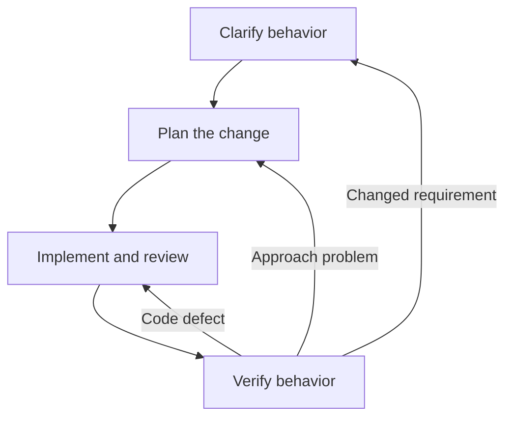

# AI Ticket Framework

Give AI a software ticket. Get focused questions, code changes, code review, and test results with less reading.

## Why use it?

- **Less reading:** get decisions and results without long process reports.
- **More control:** set task limits and checkpoints in plain language.
- **Connected work:** new findings go back to the first affected stage.

## How it works

`execute-ticket` coordinates four stages:



Start at the first stage that needs work. Stop at requested checkpoints.
Small fixes need less planning. Existing work can start at code review or verification.

## Start in two steps

### 1. Install the framework

From your project directory:

```bash
npx skills add https://github.com/orYoffe/skills \
  --skill execute-ticket clarify-ticket-behavior plan-ticket-change \
  implement-review-ticket verify-ticket-change
```

`npx` runs the [skills installer](https://github.com/vercel-labs/skills). The installer gets these skills from GitHub.
This method needs Node.js and npm. Select your agent when prompted.

### 2. Give the agent a ticket

```text
Use $execute-ticket for this ticket: <task or accessible link>.
```

The agent needs access to your codebase. Use your host's skill picker if its syntax differs.
For manual installation, copy all five skill folders into your agent's skills directory.

## Control the work

| What you want | What to say |
|---|---|
| Plan only | Investigate the ticket. Stop before code changes. |
| Human code review | Show me the diff. Wait for my review before testing. |
| Review only | Examine this change. Give findings without repairs. |
| Verification only | Do the checks. Give defects without repairs. |

For implementation, the coordinator completes the necessary stages within your task limits.
A direct stage request completes that stage and stops.
No extra ticket documents are necessary.

## What you get

Example result for a discount bug:

```text
Changed: invalid discount percentages now raise ValueError.
Checked: valid discounts, boundaries, invalid inputs, and invoice behavior.
Remaining: the checkout integration needs a test environment.
```

Missing checks remain visible. A build pass alone does not prove runtime behavior.

## Framework skills

| Skill | Responsibility |
|---|---|
| [`execute-ticket`](skills/execute-ticket/SKILL.md) | Coordinate stages and new results. |
| [`clarify-ticket-behavior`](skills/clarify-ticket-behavior/SKILL.md) | Find expected behavior and product choices. |
| [`plan-ticket-change`](skills/plan-ticket-change/SKILL.md) | Select a focused change that suits the codebase. |
| [`implement-review-ticket`](skills/implement-review-ticket/SKILL.md) | Write code or do code review without repairs. |
| [`verify-ticket-change`](skills/verify-ticket-change/SKILL.md) | Compare results with expected behavior. |

## More

- [Usage guide](docs/ticket-workflow.md): examples, preferences, and stage-only work.
- [Independent skills](docs/independent-skills.md): separate tools with their own installation and usage.

<details>
<summary>Maintainer notes</summary>

Read [repository instructions](AGENTS.md) for checks and workflow evaluation.
Use the [English writing rules](docs/writing-style.md) for text changes.
Automated checks do not prove agent behavior or full STE conformance.

</details>
